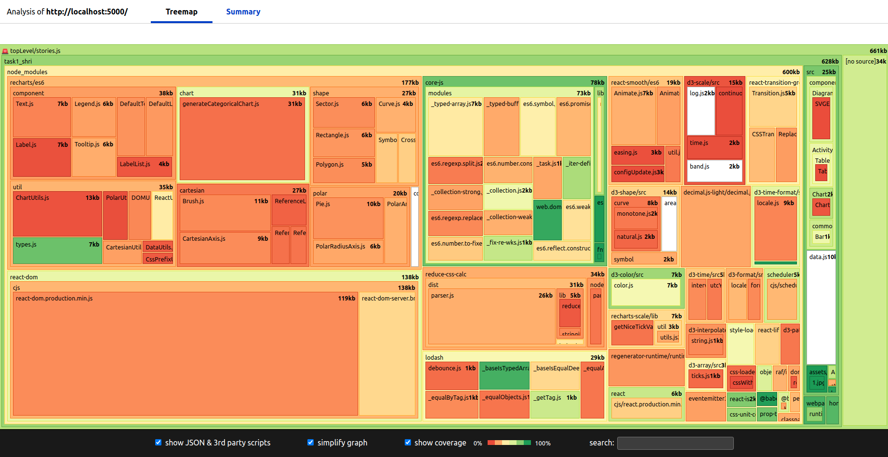
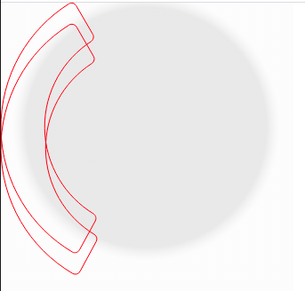

#Задание 1. Вёрстка шаблонов Stories
###React
Изначально решил выбрать React, хотя, вероятно, это не совсем уместно в задании на вёрстку.  
Для отрисовки круговой диаграммы, была использована библиотека ```recharts``` 


В сумме это вылилось в размер бандла в 637 KiB


Начинал разрабатывать pixel-perfect-first, потом адаптировать, где это возможно, на другие экраны.  
Страница с круговой диаграммой оказалась самой ресурсоёмкой. Пришлось рендерить сразу две диаграммы (светлую и тёмную) так как библиотека генерирует SVG, стили которого не поменяешь в CSS  
Так же некоторое время заняло понимание как работает radial gradient в SVG  
  
В качестве сервера решил выбрать express, так как уже имел некоторый опыт работы с ним.
Вместе с ним решил попробовать использовать шаблонизатор pug для передачи параметров в функциию ```renderTemplate()```  
Для сборки используется Webpack и babel.
